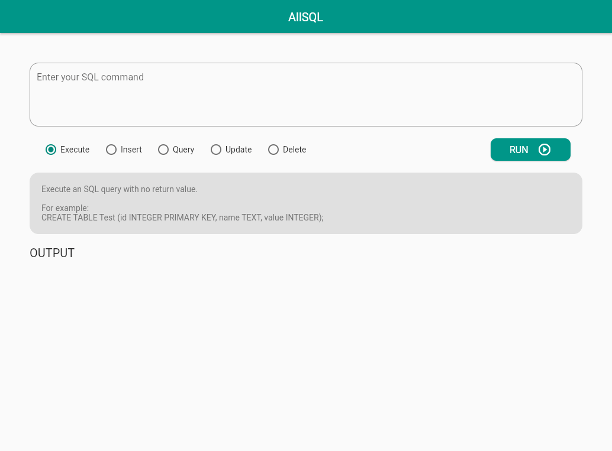

# AllSQL - An open-source compact browser based SQL Compiler

<!--  -->
<!--  -->
<!--  -->
<!--  -->
<!--  -->
<!--  -->
<!--  -->
<!--  -->

AllSQL is an open-source compact browser based SQL Compiler, built using Flutter. Please create an issue on GitHub if you find a bug or have a feature request. Feel free to create pull requests if you are interested in contributing to this project.

## ✨ Demo

*Please ignore the mouse in the gif above. The screen recording software glitched the mouse position.*

## 🤔 Why did I make AllSQL?

I have a Database Systems course in college. Our teacher recommended us to download Oracle Database 19c, which is around 2.7 GB in size. Some of my friends faced issues while installing the software. So, I wanted to make a ligh weight, compact, browser based compiler, where anyone could practice SQL commands, on any device without installing a heavy software.

## 👏 Getting Started

This project is a starting point for a Flutter application.

A few resources to get you started if this is your first Flutter project:

- [Lab: Write your first Flutter app](https://flutter.dev/docs/get-started/codelab)
- [Cookbook: Useful Flutter samples](https://flutter.dev/docs/cookbook)

For help getting started with Flutter, view our
[online documentation](https://flutter.dev/docs), which offers tutorials,
samples, guidance on mobile development, and a full API reference.

## 📚 Documentation

Coming soon!

## 🙏 Show your support

Please ⭐️ this repository if this project helped you!

## 👥 Contributors

Made with [contributors-img](https://contrib.rocks).

## 📝 License

Copyright © 2021 [Adit Luhadia](https://github.com/masteradit).

This project is [MIT](https://github.com/masteradit/allsql/blob/master/LICENSE) licensed.
